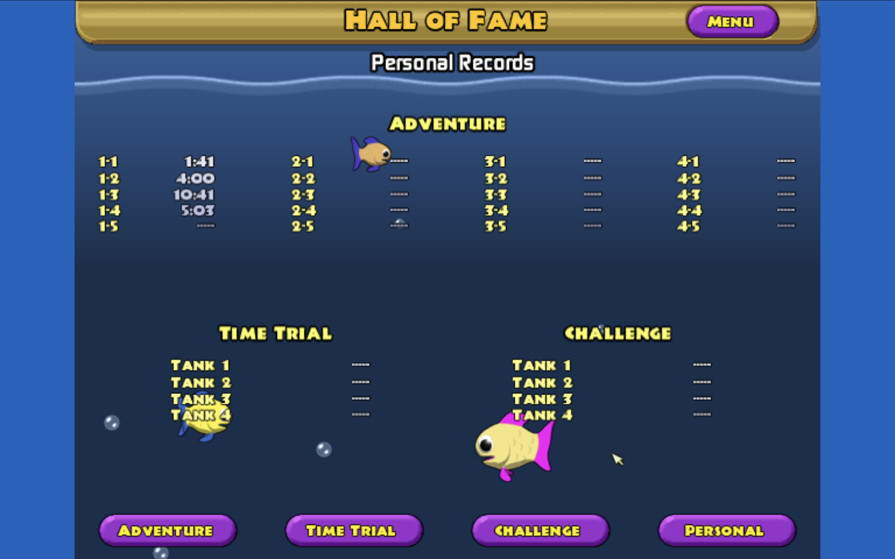

## This is a repository for users to try out Insaniquarium in their browser most of it was done in Codex which implemented PvZ-Portable into the game the idea from WinFish

The rest is working as intended hopefully also note the original repository:

https://github.com/wszqkzqk/PvZ-Portable

